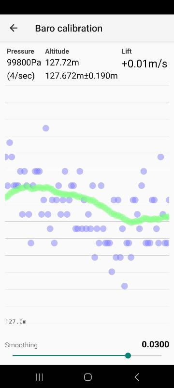

## Sensor barométrico USB
É um sensor barométrico que utliza um digispark(attiny85) e um sensor barométrico BMP280. 
Envia dados para o smartphone usando USB-CDC.

Envia: "PRS hex\n", onde hex é o valor da pressão em hexadecimal
